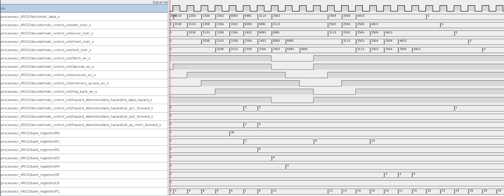

# ARO Labo 6

## Questions

### 1. Tracer les chronogrammes de l’éxecution du programme (01_main.S) pour les 2 modes de fonctionnement.
#### Chronogram 1 en mode 1


#### Chronogram 1 en mode 0


### 2. Expliquer les 2 modes de fonctionnement
```
Dans le premier chronogramme, le processeur utilise le forwarding et fait donc aucun arrêt 
car tous les aléas peuvent être réglés grâce aux registres intermédiaires.

Dans le deuxième chronogramme le processeur n'a pas de forwarding est doit régulièrement 
faire des arrêts pour éviter des problèmes liés aux aléas.
```

### 3. Utiliser le mode avec la valeur de la constante =1 et tracer le chonogramme de l’éxecution du programme (03_main.S).


### 4. Pourquoi observe t’on un arret pendant l’execution du programme avec le mode = 1 selectionné? Est-t-il normal qu’on observe un arret ?
```
Car avec les étapes:
	LDRH r1, [r2, #4]
	add r1,#0x10

Il y a des accès à la mémoire et si le programme ne s'arrête pas les deux ne peuvent pas 
se faire correctement l'une après l'autre.
```

### 5. Lors de la détection pour le forwarding, quel est l’utilité du signal sel_mem_i dans la détection ? Pourquoi ce signal est utile ?
```
Son utilité est de définir si l'instruction en cours nécessite un accès à la mémoire.
Celui-ci est utile pour savoir quel type d'aléa nous traitons et donc quel type
de forwarding effectuer.
```

### 6. Est-il nécessaire de faire un data forwarding depuis le stage WRITE_BACK et pourquoi ?
```
Il peut être nécessaire ou plutôt utile car si nous le faisons, 
nous pouvons economiser un cycle qui serait utilisé pour écrire les valeurs dans les registres.
```

### 7. Quelles sont les conditions pour que le forwarding puisse avoir lieu ?
```
Il faut que la ou les valeurs nécessaires soit actuellement dans les registres de forwarding (E, F1, F2, M).
```

### 8. Quelles sont les avantages et inconvénients du forwarding sur la gestion des aléas de données?
```
Les avantages sont principalements dans l'économisation de temps et donc l'augmentation de l'efficacité générale du processeur.

Il y a très peu d'inconvénients en ce qui concerne le forwarding mais il y a plus d'étapes 
dans notre processeur donc il est légèrement plus complexe.
```

### 9. Que permet de réaliser les signaux sel_opX_forward_s dans le circuit Execute ?
```
Ils permettent de sélectionner la valeur nécessaire dans les registres du forwarding 
ou ne pas les utiliser dans le cas où le forwarding n'est pas nécessaire.
```

### 10. Dans le circuit Execute, pourquoi il y a un registre connecté à l’entrée memory_data_out_i?
```
Ceci est le registre M depuis lequel on prend la valeur quand on utilise le forwarding 
avec une opération qui accède à la mémoire.
```